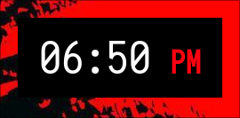

# Clock Widget

Written in Rust using GTK4, this widget was an attempt to recreate what can be accomplished using [Eww](https://github.com/elkowar/eww).

Though relatively simple, it was a bit complicated for me to figure out how to introduce the GTK Layer Shell into GTK4, which is presumably why eww still uses GTK3.

Hopefully this stands as an example project to help devs learn how to build reliable GTK4 widgets in Rust.
